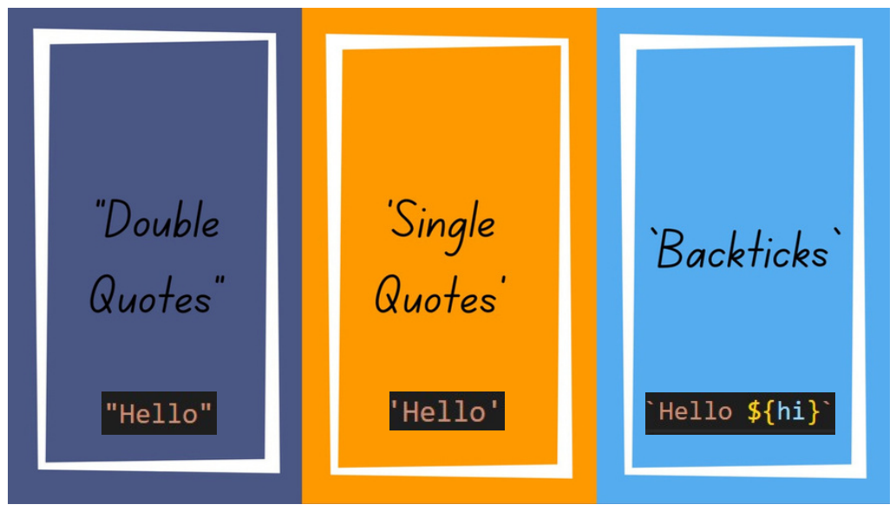

# String in Java Script

Существует 3 вида создания string-а в JS: 1) Первый способ это с помощью двойных кавычек - (""). 2) Второй способ с помощью одинарных ковычек (''). 3) Третий способ с помощью backticks - бектикс это похоже на одинарных ковычек.



# String методы в JS

В JS существует много видов методов. Метод - это блок кода который выполняется только при вызове. В методах можно задать данных называемых параметрами.
Методы используют для выполнения действий и они так же исвестны как функции. Например: 
1) CharAt() - с помощью этого метода можно отделить от какого нибудь слова одну букву. Этот метод получает в параметрах только цыфры. Цыфры это индекс букв состоящих слов.

```js 
let a = "Hello softclub"
console.log(a.charAt(2));  //l
console.log(a.charAt(8));  //f
console.log(a.charAt(10)); //c
```


2) at() - этот метод работает так же как и charAt() но разница в том что at() может получать в параметрах отрицательные числа. А задача этих методов абсолюно одинаковы.

```js 
let a = "Hello softclub"
console.log(a.charAt(-1));  //b
console.log(a.charAt(-3));  //l
console.log(a.charAt(-8));  //c
```

3) Concat - этот метод поможет нам соеденить две определённо разных string-ов. 

```js 
let a = "Hello"
let b = "Softclub"
console.log(a.concat(" ", b))
// Hello Softclub
```

# Существует и числовые методы

Числовые методы в основном помогаю нам сделать какие нибудь  работы например удалить остаток или дать рандомное число или найти максимальное и минимальное число, найти корень каких нибудь чисел, сделать отрицательную цыфру положительной и тому подобное.

1) Math.floor - Этот метод можеть удалить остаток чисел.
```js 
let a = 45.15642
console.log(Math.floor(a)) // 45
```

2) Math.max - этот метод можеть найти из нескольких чисел самую большую из них.
```js 
let a = (8,10,2,4,61,3)
console.log(Math.max(a)) // 61
```
3) Math.abs - этот метод может сделать из отрицателных чисел положительную. 

```js
let a = (-25)
console.log(Math.abs(a)) //25
```

